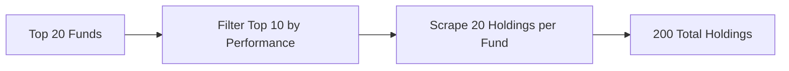

# HedgeFollow Pipeline Documentation

## 🎯 Stratégie de Scraping

Le pipeline HedgeFollow suit cette stratégie optimisée :



## 📊 Structure des Données

### 1. Funds Data (`funds_top10_filtered.csv`)

| Colonne | Type | Description | Exemple |
|---------|------|-------------|---------|
| `fund_id` | str | Identifiant unique | `blackrock-inc` |
| `fund_name` | str | Nom du fond | `BlackRock Inc` |
| `fund_url` | str | URL HedgeFollow | `https://hedgefollow.com/funds/BlackRock` |
| `perf_3y_annualized` | float | Performance annualisée 3 ans | `32.76` |
| `aum_billions` | float | AUM en milliards USD | `5.67` |
| `num_holdings` | int | Nombre de positions | `5386` |
| `top20_concentration` | float | % du portfolio dans top 20 | `37.85` |
| `turnover` | float | Taux de rotation | `6.37` |
| `rating` | float | Note (étoiles) | `4.5` |

### 2. Holdings Data (`holdings_top10funds_YYYYMMDD.csv`)

| Colonne | Type | Description | Exemple |
|---------|------|-------------|---------|
| `fund_id` | str | ID du fond parent | `blackrock-inc` |
| `fund_name` | str | Nom du fond | `BlackRock Inc` |
| `position` | int | Rang dans le portfolio | `1` |
| `ticker` | str | Symbol boursier | `NVDA` |
| `company_name` | str | Nom de l'entreprise | `Nvidia Corporation` |
| `portfolio_pct` | float | % du portfolio | `6.34` |
| `shares_owned` | float | Nombre d'actions | `1.93e9` |
| `value_millions` | float | Valeur en millions USD | `359.96` |
| `latest_activity_pct` | float | Changement récent (%) | `1.02` |

## 🚀 Utilisation

### Installation Rapide

```bash
# Clone et setup
git clone https://github.com/Bencode92/smartmoney-scraper.git
cd smartmoney-scraper
pip install -r requirements.txt
```

### Modes d'Exécution

#### 1. Mode Test (Rapide)
```bash
# 5 fonds → 3 top → 5 holdings = ~15 positions
python run_hedgefollow.py --mode test
```

#### 2. Mode Quick
```bash
# 15 fonds → 10 top → 10 holdings = ~100 positions
python run_hedgefollow.py --mode quick
```

#### 3. Mode Full (Recommandé)
```bash
# 20 fonds → 10 top → 20 holdings = ~200 positions
python run_hedgefollow.py --mode full
```

#### 4. Mode Custom
```bash
# Paramètres personnalisés
python run_hedgefollow.py --funds 30 --top 15 --holdings 25
```

### Via Script Shell

```bash
# Permissions d'exécution
chmod +x scripts/run_hedgefollow.sh

# Lancer
./scripts/run_hedgefollow.sh        # Mode full par défaut
./scripts/run_hedgefollow.sh test   # Mode test
./scripts/run_hedgefollow.sh quick  # Mode quick
```

## 📈 Analyse des Résultats

### Chargement des Données

```python
import pandas as pd

# Charger les fonds top performers
funds = pd.read_csv('data/raw/hedgefollow/funds_top10_filtered.csv')

# Charger les holdings
holdings = pd.read_csv('data/raw/hedgefollow/holdings_top10funds_20241124.csv')

# Afficher les top fonds
print(funds[['fund_name', 'perf_3y_annualized', 'aum_billions']].head())
```

### Analyses Avancées

#### 1. Holdings les Plus Populaires

```python
# Tickers présents dans le plus de fonds
popular = holdings['ticker'].value_counts()
print(f"Top 10 Holdings Populaires:")
print(popular.head(10))

# Pourcentage de fonds détenant chaque ticker
coverage = (popular / funds['fund_id'].nunique() * 100).round(1)
print(f"\nCouverture (% des fonds):")
print(coverage.head(10))
```

#### 2. Concentration par Fond

```python
# Concentration moyenne dans le top 20
concentration = holdings.groupby('fund_id')[['portfolio_pct']].sum()
print(f"Concentration moyenne top 20: {concentration.mean():.1f}%")

# Fonds les plus/moins concentrés
print(f"\nPlus concentrés:")
print(concentration.nlargest(3))
print(f"\nMoins concentrés:")
print(concentration.nsmallest(3))
```

#### 3. Activité Récente

```python
# Holdings avec plus d'activité
active = holdings.nlargest(10, 'latest_activity_pct')[
    ['ticker', 'company_name', 'latest_activity_pct', 'fund_name']
]
print("Holdings avec forte activité récente:")
print(active)
```

#### 4. Valeur Totale par Ticker

```python
# Agrégation de la valeur totale
ticker_value = holdings.groupby('ticker').agg({
    'value_millions': 'sum',
    'fund_id': 'count'
}).rename(columns={'fund_id': 'num_funds'})

ticker_value = ticker_value.sort_values('value_millions', ascending=False)
print(f"Top 10 par valeur totale (M$):")
print(ticker_value.head(10))
```

## 🛡️ Fonctionnalités de Robustesse

### Anti-Détection
- ✅ **12+ User-Agents rotatifs** : Chrome, Firefox, Safari, Edge
- ✅ **Headers dynamiques** : Accept-Language, Referer variés
- ✅ **Throttling intelligent** : 2-5 secondes aléatoires entre requêtes
- ✅ **Backoff exponentiel** : En cas d'erreur 429/503

### Validation des Données
- ✅ **Vérification structure HTML** : Détection changements site
- ✅ **Validation colonnes** : Vérification présence données critiques
- ✅ **Détection anomalies** : Valeurs aberrantes, données manquantes
- ✅ **Logs détaillés** : Traçabilité complète

### Monitoring
- ✅ **Métriques temps réel** : Durée, volume, erreurs
- ✅ **Alertes configurables** : Discord/Slack webhooks
- ✅ **Health checks** : Vérification santé système
- ✅ **Logs structurés** : Format JSON pour analyse

## 📊 Exemples de Sortie

### Console Output

```
🚀 HEDGEFOLLOW SCRAPING PIPELINE
============================================
📊 Configuration:
  • Fonds à scraper: 20
  • Top performers à garder: 10
  • Holdings par fond: 20

🎯 Scraping top 20 funds from HedgeFollow...
  #1: BlackRock Inc - Perf: 32.8% - AUM: $5.7B
  #2: State Street Corp - Perf: 30.0% - AUM: $2.9B
  ...

🎯 Selected top 10 funds by performance:
  • Renaissance Technologies: 35.80% annualized
  • BlackRock Inc: 32.76% annualized
  ...

📊 Scraping holdings for renaissance-tech...
  → Scraped 20 holdings

✅ PIPELINE TERMINÉ AVEC SUCCÈS!
⏱️ Durée totale: 125.3 secondes
📊 Résultats:
  • Fonds traités: 10
  • Holdings collectées: 200
  • Tickers uniques: 87
  • Valeur totale: $2453.7M
```

### Fichiers Générés

```
data/raw/hedgefollow/
├── funds_top20_raw.csv          # 20 fonds initiaux
├── funds_top10_filtered.csv     # 10 top performers
└── holdings_top10funds_20241124.csv  # 200 holdings
```

## 🔧 Configuration Avancée

### Variables d'Environnement

Créer `.env` :

```env
# Anti-détection
HTTP_USER_AGENT="Mozilla/5.0..."  # Optionnel, rotation auto
REQUESTS_SLEEP_SECONDS=2

# Alertes (optionnel)
DISCORD_WEBHOOK_URL=https://discord.com/api/webhooks/...
SLACK_WEBHOOK_URL=https://hooks.slack.com/services/...

# Paramètres
HEDGEFOLLOW_TOP_N_FUNDS=20
HEDGEFOLLOW_TOP_N_PERF=10
HEDGEFOLLOW_TOP_N_HOLDINGS=20
```

### Proxy Configuration

```python
# Dans src/utils/http.py
proxies = [
    "http://proxy1.com:8080",
    "http://proxy2.com:8080",
]

smart_session = SmartSession(proxies=proxies)
```

## 🚨 Troubleshooting

### Erreurs Communes

| Erreur | Cause | Solution |
|--------|-------|----------|
| `ValueError: No funds data` | Structure HTML changée | Vérifier sélecteurs CSS dans `hedgefollow_pipeline.py` |
| `HTTP 429` | Rate limiting | Augmenter `REQUESTS_SLEEP_SECONDS` |
| `HTTP 403` | Détection bot | Activer proxies, vérifier User-Agent |
| `No holdings table` | Page fond différente | Ajuster sélecteurs holdings |

### Debug Mode

```bash
# Mode verbose pour debug
python run_hedgefollow.py --mode test --verbose

# Dry run (test config sans scraper)
python run_hedgefollow.py --dry-run
```

### Logs

```bash
# Voir les logs
tail -f logs/hedgefollow_*.log

# Analyser les erreurs
grep ERROR logs/hedgefollow_*.log
```

## 📈 Performances

| Mode | Fonds | Holdings | Durée Approx. | Requêtes |
|------|-------|----------|---------------|----------|
| Test | 5 | 15 | ~30s | 6 |
| Quick | 15 | 100 | ~2min | 11 |
| Full | 20 | 200 | ~3-4min | 21 |

## 🔄 Automatisation

### GitHub Actions (Daily)

Le workflow `.github/workflows/hedgefollow-daily.yml` lance automatiquement le scraping chaque jour à 6h UTC.

### Crontab Local

```bash
# Ajouter au crontab
crontab -e

# Scraping quotidien à 8h
0 8 * * * cd /path/to/smartmoney-scraper && ./scripts/run_hedgefollow.sh full
```

## 📝 Notes Importantes

1. **Rate Limiting** : Respecter 2-5 secondes entre requêtes
2. **Validation** : Toujours vérifier données avant utilisation
3. **Cache** : Les données sont cachées 24h par défaut
4. **Monitoring** : Configurer alertes pour production

## 🤝 Support

- **Issues** : [GitHub Issues](https://github.com/Bencode92/smartmoney-scraper/issues)
- **Documentation** : Ce fichier + README.md
- **Logs** : Vérifier `logs/` pour debug

---

*Développé avec ❤️ pour le Smart Money tracking*
