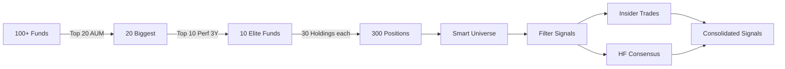

# 🎯 Smart Money Pipeline - Documentation Complète

## Vue d'ensemble

Pipeline complet pour identifier les **meilleures opportunités d'investissement** en suivant le "Smart Money" - les hedge funds élite avec les meilleures performances.

### 🔄 Stratégie Exacte



## 📊 Architecture des Fichiers

```
smartmoney-scraper/
├── src/hedgefollow/
│   ├── smart_money_pipeline.py   # Pipeline principal (AUM→Perf→Holdings)
│   ├── insider_tracker.py        # Scraper Insider Trading
│   └── hf_tracker.py             # Scraper HF Trades
├── run_smart_money.py            # Orchestrateur complet
├── data/
│   ├── raw/hedgefollow/
│   │   ├── funds_all_scraped.csv          # Tous les fonds
│   │   ├── funds_top20_by_aum.csv         # Top 20 par AUM
│   │   ├── funds_top10_aum_and_perf.csv   # Top 10 élite
│   │   ├── holdings_top10funds_30each_*.csv # 300 positions
│   │   ├── insiders_raw_*.csv             # Trades insiders
│   │   └── hf_trades_raw_*.csv            # Trades HF
│   └── processed/
│       ├── smart_universe_tickers.csv      # Univers (~100 tickers)
│       ├── insiders_smart_universe.csv     # Insiders filtrés
│       ├── hf_trades_smart_universe.csv    # HF trades filtrés
│       ├── hf_consensus_signals.csv        # Consensus (3+ funds)
│       ├── smart_money_flows.csv           # Flux nets
│       └── consolidated_smart_signals.csv  # SIGNAUX FINAUX
```

## 🚀 Installation & Usage

### Installation

```bash
git clone https://github.com/Bencode92/smartmoney-scraper.git
cd smartmoney-scraper
pip install -r requirements.txt
```

### Exécution Rapide

```bash
# Mode complet (recommandé)
python run_smart_money.py --mode full

# Mode test (rapide)
python run_smart_money.py --mode test

# Mode personnalisé
python run_smart_money.py \
    --top-aum 25 \
    --top-perf 12 \
    --holdings 40 \
    --min-value 10.0
```

### Options

| Option | Description | Défaut |
|--------|-------------|--------|
| `--mode` | `full`, `quick`, `test` | `full` |
| `--top-aum` | Nombre de fonds par AUM | 20 |
| `--top-perf` | Nombre de top performers | 10 |
| `--holdings` | Holdings par fond | 30 |
| `--min-value` | Valeur min en M$ | 5.0 |
| `--skip-insiders` | Skip analyse insiders | False |
| `--skip-hf` | Skip HF tracker | False |
| `--verbose` | Debug logging | False |

## 📈 Pipeline Détaillé

### Phase 1: Construction Univers Smart Money

```python
# 1. Scraper TOUS les fonds
df_all = scrape_all_funds(max_funds=100)

# 2. Top 20 par AUM (les plus gros)
df_top_aum = df_all.nlargest(20, 'aum_billions')

# 3. Top 10 par Performance 3Y
df_elite = df_top_aum.nlargest(10, 'perf_3y_annualized')

# 4. Top 30 Holdings par fond
for fund in df_elite:
    holdings = scrape_fund_holdings(fund)
    holdings_top30 = holdings.nlargest(30, 'portfolio_pct')
```

**Résultat**: ~100 tickers uniques représentant les **convictions fortes** des meilleurs gestionnaires.

### Phase 2: Insider Trading Analysis

```python
# Scraper les insiders (>$5M)
insiders = scrape_insider_trades(timeframe="1 Week")

# Filtrer sur univers Smart Money
insiders_smart = insiders[insiders['ticker'].isin(smart_universe)]

# Focus sur CEO, CFO, Directors, 10% Owners
insiders_significant = filter_significant_roles(insiders_smart)
```

**Signaux**: Achats importants d'insiders sur les tickers Smart Money.

### Phase 3: Hedge Fund Tracker

```python
# Scraper les trades récents HF
hf_trades = scrape_hedgefund_trades()

# Filtrer sur univers
hf_smart = hf_trades[hf_trades['ticker'].isin(smart_universe)]

# Identifier consensus (3+ funds achètent)
consensus = find_consensus_buys(hf_smart, min_funds=3)

# Analyser les flux
net_flows = calculate_smart_money_flows(hf_smart)
```

**Signaux**: Consensus d'achat et flux nets positifs.

### Phase 4: Signaux Consolidés

Score composite (0-100) basé sur:

| Critère | Points Max | Description |
|---------|------------|-------------|
| Holdings | 30 | Nombre de fonds élite détenant |
| Portfolio % | 20 | Poids moyen dans portfolios |
| Insiders | 20 | Nombre/valeur achats insiders |
| HF Consensus | 15 | Nombre de HF achetant |
| Flow Net | 15 | Flux net positif |

**Classification**:
- **STRONG BUY**: Score ≥ 70
- **BUY**: Score ≥ 50  
- **HOLD**: Score ≥ 30
- **WATCH**: Score < 30

## 📊 Analyse des Résultats

### Chargement des Données

```python
import pandas as pd

# Signaux consolidés
signals = pd.read_csv('data/processed/consolidated_smart_signals.csv')

# Top 10 signaux
top_signals = signals.nlargest(10, 'total_score')
print(top_signals[['ticker', 'signal', 'total_score', 'num_funds_holding']])
```

### Analyses Avancées

#### 1. Signaux Consensus Fort

```python
# Tickers avec insider + HF consensus
strong_signals = signals[
    (signals['num_insiders_buying'] > 0) &
    (signals['hf_consensus_funds'] >= 3)
]
```

#### 2. Concentration Smart Money

```python
# Tickers les plus détenus
most_held = signals.nlargest(10, 'num_funds_holding')
print(f"Average portfolio %: {most_held['avg_portfolio_pct'].mean():.2f}%")
```

#### 3. Flux Récents

```python
# Plus gros flux entrants
inflows = signals[signals['net_flow_millions'] > 50]
print(f"Strong inflows: {len(inflows)} tickers")
```

#### 4. Score Distribution

```python
import matplotlib.pyplot as plt

plt.figure(figsize=(10, 6))
plt.hist(signals['total_score'], bins=20, edgecolor='black')
plt.axvline(70, color='green', linestyle='--', label='STRONG BUY')
plt.axvline(50, color='orange', linestyle='--', label='BUY')
plt.xlabel('Score')
plt.ylabel('Count')
plt.title('Smart Money Signal Distribution')
plt.legend()
plt.show()
```

## 🎯 Exemples de Résultats

### Top Signaux Typiques

```
🏆 TOP 10 SMART MONEY SIGNALS:
----------------------------------------------------------------------
 1. NVDA   | Score: 87.5 | Signal: STRONG BUY | Funds: 8 | Insiders: 3
 2. MSFT   | Score: 82.3 | Signal: STRONG BUY | Funds: 7 | Insiders: 2
 3. GOOGL  | Score: 75.1 | Signal: STRONG BUY | Funds: 6 | Insiders: 1
 4. AMZN   | Score: 68.9 | Signal: BUY       | Funds: 6 | Insiders: 0
 5. META   | Score: 65.4 | Signal: BUY       | Funds: 5 | Insiders: 2
```

### Distribution des Signaux

```
📊 Signal Distribution:
  • STRONG BUY: 8 tickers
  • BUY: 15 tickers
  • HOLD: 42 tickers
  • WATCH: 35 tickers
```

## ⚡ Performance & Optimisation

| Phase | Durée Approx | Requêtes |
|-------|--------------|----------|
| Funds Scraping | ~30s | 1 |
| Holdings (10 funds) | ~3 min | 10 |
| Insider Tracker | ~20s | 1 |
| HF Tracker | ~20s | 1 |
| **Total** | **~4-5 min** | **13** |

### Tips d'Optimisation

1. **Cache**: Les données sont valides 24h
2. **Mode Quick**: 15 AUM → 8 perf → 20 holdings
3. **Skip Options**: `--skip-insiders` ou `--skip-hf` si pas nécessaire

## 🔧 Configuration Avancée

### Variables d'Environnement

```bash
# .env
REQUESTS_SLEEP_SECONDS=3        # Délai entre requêtes
HEDGEFOLLOW_TOP_N_FUNDS=20      # Top AUM par défaut
MIN_TRANSACTION_VALUE_USD=5000000  # 5M$ minimum

# Alertes (optionnel)
DISCORD_WEBHOOK_URL=https://...
SLACK_WEBHOOK_URL=https://...
```

### Personnalisation des Scores

Dans `run_smart_money.py`, ajuster les poids:

```python
# Modifier les coefficients de scoring
signals['score_holdings'] = (signals['num_funds_holding'] / 10 * 40)  # 40 pts au lieu de 30
signals['score_insiders'] = (signals['num_insiders_buying'] * 7)      # 7 pts par insider
```

## 📝 Structure des Données

### funds_top10_aum_and_perf.csv

| Colonne | Description |
|---------|-------------|
| `fund_id` | Identifiant unique |
| `fund_name` | Nom du fond |
| `perf_3y_annualized` | Performance annualisée % |
| `aum_billions` | Assets Under Management |
| `rank_aum` | Rang par AUM (1-20) |
| `rank_perf_3y` | Rang par performance (1-10) |

### consolidated_smart_signals.csv

| Colonne | Description |
|---------|-------------|
| `ticker` | Symbol boursier |
| `total_score` | Score 0-100 |
| `signal` | STRONG BUY/BUY/HOLD/WATCH |
| `num_funds_holding` | Nombre de fonds élite |
| `avg_portfolio_pct` | % moyen du portfolio |
| `num_insiders_buying` | Insiders achetant |
| `hf_consensus_funds` | HF en consensus |
| `net_flow_millions` | Flux net en M$ |

## 🚨 Troubleshooting

| Problème | Solution |
|----------|----------|
| `No funds data` | Vérifier structure HTML, sélecteurs CSS |
| `HTTP 429` | Augmenter `REQUESTS_SLEEP_SECONDS` |
| `Empty universe` | Vérifier que holdings sont bien scrapées |
| `No signals` | Réduire `--min-value` ou timeframe |

## 🎓 Concepts Clés

- **AUM First**: On prend d'abord les GROS (capacité d'analyse)
- **Performance Filter**: Parmi les gros, on garde les PERFORMANTS
- **Top Holdings**: Les 30 plus grosses positions = convictions fortes
- **Smart Universe**: ~100 tickers représentant le "best of" Smart Money
- **Consensus**: Quand plusieurs élites achètent = signal fort
- **Flow Analysis**: Entrées vs sorties de capitaux

## 📚 Références

- [HedgeFollow](https://hedgefollow.com) - Source principale
- [13F Filings](https://www.sec.gov/edgar) - Données SEC officielles
- [Form 4](https://www.sec.gov/forms) - Transactions insiders

## 🤝 Support

- **Issues**: [GitHub Issues](https://github.com/Bencode92/smartmoney-scraper/issues)
- **Email**: benoit.comas@gmail.com

---

*Pipeline développé pour suivre précisément le Smart Money institutionnel 🎯*
